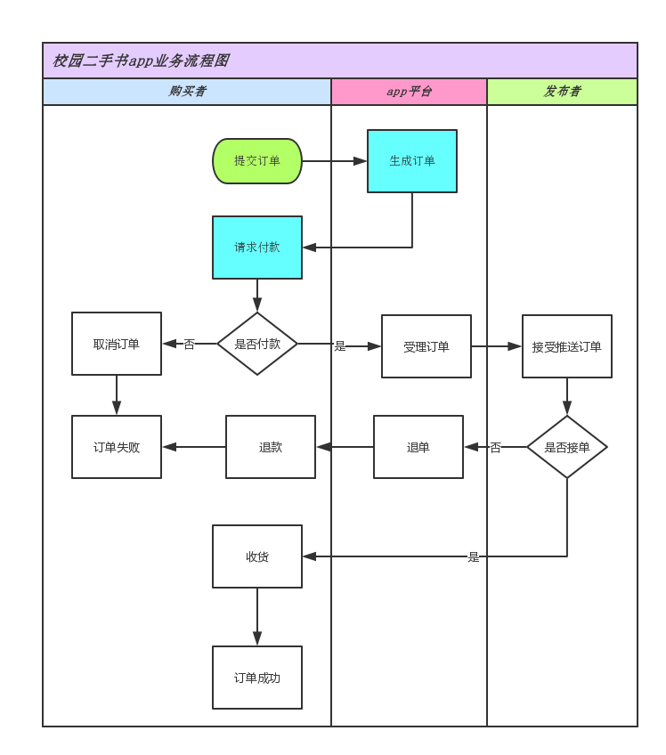
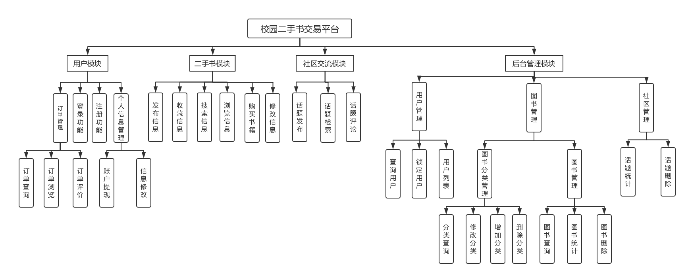

需求分析报告

引言
====

编写目的
--------

首先，为了准确理解项目的功能、性能、可靠性等具体要求，将用户非形式的需求表述转化为完整的需求定义，从而确定系统边界和内容，我们编写此需求分析报告；

其次，为了保证项目团队按时按质地完成项目目标，使项目工作开展的各个过程合理有序，有必要以文件化的形式，描述项目生命周期内的工作任务范围、各项工作的任务分解、项目团队组织结构等；

第三，为了规范化今后网站代码的编写，提高软件开发过程中的能见度，便于对网站开发过程中的控制与管理，我们编写此需求分析报告；

最后，此需求分析报告同时提出了本校园二手书网站的开发过程，便于程序员与用户之间的交流、协作，并作为工作成果的原始依据，同时也表明了此网站的共性，以期能够获得更大范围的应用。

项目背景
--------

随着大学生课程数量逐渐增加，教材需求量也随之增加，同时大学生废旧课程书籍也逐渐增多；另一方面，大学生购置的课外书、备考资料、单词书等，使用的周期仅仅是数月或者数年，这一资源若不加以应用则会造成一定程度的浪费。

而随着物价上涨，书籍价格也随着迅速攀升，这对于暂无收入的大学生来说也是一笔不小的开支；以华中师范大学信息管理学院为例进行计算：本科生人数约为500人，每个学生一个学年以25门课计算，如果一门课使用一本教材，那么信息管理学院本科生每年书籍消耗量约为12500本；除此之外，还包括相关的辅导资料、其他考试复习书籍以及一些业余学习书籍等。由此可见，校园二手书市场存在着巨大的市场需求。

为了教材等二手书能够在高校中更好地流通，节约资源，同时帮助高校大学生妥善有效率地处理旧书，我们设计此校园二手书网站。

名词解释
--------

定义：

SQL SERVER：系统服务器所使用的数据库管理系统（DBMS）。

SQL：一种用于访问查询数据库的语言。

事物流：数据进入模版后可能有多种路径进行处理

重载：通过重载可以使多个具有相同功能但参数不同的方法共享一个方法名。

静态数据：指在运行过程中主要作为参考的数据，一般不会随着运行而改变。

动态数据：包括所有在运行中要发生变化的数据，以及在运行中要输入、输出的数据。

响应时间：对用户的输入或请求作出反应的时间。

缩写：

系统：若未特别指出，统指本校园二手书网站系统。

UML：统一建模语言，是一套用来设计软件蓝图的标准建模语言，是一种从软件分析、设计到编写程序规范的标准化建模语言。

参考资料
--------

[1] Andrew Troelsen.《C\#与.NET 4高级程序设计》.人民邮电出版社,2011年4月    

[2] 张俊,崔海波.《ADO.NET数据库应用开发》.机械工业出版社,2008年1月         

[3] 徐孝凯,贺佳英.《数据库基础与SQL Server应用开发》.清华大学出版社,2008年4月   

[4]王令羲.Car Care MIS系统需求分析的调研报告.武汉轻工大学,2013年5月

[5]袁胡军熊科云.如何做好网站开发需求分析报告.江西中医学院,2008年12月

任务概述
========

本网站的开发，目的在于解决校园中的二手书回收问题。既可以让手中有闲置书籍，又不知如何处理的同学来展示和出售他们的闲书，又可以让低年级的希望以低价购买到所需要图书达成愿望。

本网站的应用目标主要是华师的在校学生及老师。可以为所有的用户提供一个平台，任何人都可以随时成为书籍出售者和购买者。拥有书籍的同学可以将书籍的信息通过平台发布出去，需要购买书籍的同学可以在平台上寻找是否有自己所需要的书籍信息，如若购买者找到了所需的书籍，就可以与卖方联系，将书籍出售。

本网站为独立的网站，所有的内容自含，且为一个独立的系统，不与其他的任何平台有联系。

数据描述
========

数据分为静态数据和动态数据。所谓静态数据，指在运行过程中主要作为参考的数据，它们在很长一段时间内不会变化，一般也不会随着运行而改变，所谓动态数据，包括所有在运行中要发生变化的数据，以及在运行中要输入、输出的数据。

静态数据
--------

### 系统用户静态数据

系统包含三类角色：注册学生用户，系统管理员和游客，不同用户的静态数据的种类不同。

| 注册学生用户 | ID,用户名，密码，真实姓名，性别，专业，电话，QQ（可选项），支付宝关联账号 |
|--------------|---------------------------------------------------------------------------|
| 系统管理员   | ID，管理员用户，管理员密码                                                |
| 游客         | 不记录静态数据                                                            |

### 系统模块静态数据

| 图书类别表 | ID，图书类别表，说明                                                                                             |
|------------|------------------------------------------------------------------------------------------------------------------|
| 图书信息表 | ID，图书名称，图书类别，作者，出版社，价格，图片，发布者用户ID，折旧程度，出售价格，附加信息，出售状态，发布时间 |

动态数据
--------

### 系统用户动态数据

| 注册学生用户 | 收藏用户ID,收藏图书ID，浏览图书ID,话题评论ID，话题评论内容（关键词） |
|--------------|----------------------------------------------------------------------|
| 系统管理员   | 被修改用户ID，被修改图书ID，管理员日志表单ID,数据库日志表单ID        |
| 游客         | 收藏用户ID,收藏图书ID，浏览图书ID,话题评论ID，话题评论内容（关键词） |

### 系统模块动态数据

| 话题表         | 话题ID,话题标题，内容（关键词），发布时间，发布者ID      |
|----------------|----------------------------------------------------------|
| 历史订单表     | 订单ID，图书ID，交易金额，交易用户ID，时间，附加信息     |
| 管理员日志表单 | 系统变动类目ID，变动时间                                 |
| 数据库日志表单 | ID,行为信息，更新时间                                    |
| 需求图书表     | ID，图书名称，作者，出版社，求购者ID，附加信息，发布时间 |
| 图书发布栏表   | 发布ID，发布标题，内容（关键词），发布时间，发布者ID     |

功能需求
========

流程图
------

>   F:\\F盘\\大三上\\课\\C\#\\期末项目\\系统流程图.png

系统用例图
----------

![C:\\Users\\hp\\Documents\\Tencent Files\\1041403539\\Image\\Group\\CA{S6{\~ZP{UN3P]]C\@_N)IH.png](media/ecc42623e2d314aa3e5d831c08b1157f.png)

功能划分
--------

功能描述
--------

>   对最底层的功能所要完成的功能进行详细描述，填入下表中：

| 功能名称     | 功能详细描述                                                   |
|--------------|----------------------------------------------------------------|
| 登录功能     | 用户通过输入用户名和密码进行登录                               |
| 注册功能     | 没有注册的用户填写个人信息注册                                 |
| 个人信息修改 | 用户对自己已经填写的个人信息进行修改                           |
| 订单查询     | 用户通过输入关键字来查询历史订单                               |
| 订单浏览     | 用户进入订单页面浏览订单                                       |
| 订单评价     | 用户对没有评价过的完成的订单进行评价                           |
| 账户提现     | 用户对自己账户余额提现到自己的支付宝账户                       |
| 发布信息     | 用户发布二手书信息，信息的类型为求购或者出售                   |
| 收藏信息     | 用户对有潜在需求的出售图书的信息进行收藏                       |
| 搜索信息     | 用户通过输入书籍的关键字以及类型进行搜索                       |
| 浏览信息     | 用户在APP首页浏览发布的图书信息                                |
| 购买书籍     | 用户可以通过收藏栏、或者通过直接浏览信息进行结算               |
| 修改信息     | 用户对自己发布的书籍信息进行修改                               |
| 话题发布     | 用户在社区交流模块发布话题                                     |
| 话题评论     | 用户针对某个话题发表评论                                       |
| 话题检索     | 用户针对某个话题进行检索                                       |
| 用户锁定     | 后台管理员对在社区交流模块对系统进行灌水的用户进行锁定         |
| 查询用户     | 后台管理员通过查询用户名来查询用户的相关信息以及发布的信息     |
| 用户列表     | 后台管理员通过用户列表可以看到所有用户                         |
| 图书分类增加 | 后台管理员增加图书的分类以便前台用户发布或者求购该分类下的图书 |
| 图书分类删除 | 后台管理员删除指定的分类                                       |
| 图书分类修改 | 后台管理员针对某个已经存在的分类进行名称的修改                 |
| 图书分类查询 | 后台管理员针对已经存在的分类进行查询                           |
| 图书统计     | 后台管理员统计所有的前台用户发布了多少条图书信息               |
| 图书查询     | 后台管理员通过输入图书名来查询相关图书                         |
| 图书删除     | 后台管理员删除前台用户不合时宜的书籍                           |
| 话题统计     | 后台管理员统计社区交流模块的话题数量                           |
| 话题删除     | 后台管理员对敏感的话题进行删除                                 |

数据与功能的对应关系
--------------------

| 功能名称     | 输入                                                                                                              | 输出                                                                                                                         |
|--------------|-------------------------------------------------------------------------------------------------------------------|------------------------------------------------------------------------------------------------------------------------------|
| 登录功能     | 用户名、密码、验证码                                                                                              | 用户ID                                                                                                                       |
| 注册功能     | 用户名、手机号、密码、性别、支付宝账号、QQ、专业                                                                  | 用户ID                                                                                                                       |
| 个人信息修改 | 用户名、手机号、密码、性别、支付宝账号、QQ、专业(可选) 用户ID(必选)                                               | True/False                                                                                                                   |
| 订单查询     | 书籍名称                                                                                                          | NULL/图书名称，交易价格，发布时间，类型（发布/求购）                                                                         |
| 订单浏览     | 用户ID                                                                                                            | NULL/图书名称，交易价格，发布时间，类型（发布/求购）                                                                         |
| 订单评价     | 用户ID、订单ID                                                                                                    | True/false                                                                                                                   |
| 账户提现     | 用户ID、支付宝账户                                                                                                | Ture/false                                                                                                                   |
| 发布信息     | 用户ID，图书名称，图书类别ID，作者，出版社、标价，图片，折旧程度，出售价格，附加信息，发布时间，类型（发布/求购） | True/false                                                                                                                   |
| 收藏信息     | 用户ID，图书信息表ID                                                                                              | True/false                                                                                                                   |
| 搜索信息     | 图书名称                                                                                                          | NULL/图书信息表ID，图书名称，图书类别ID，作者，出版社、标价，图片，折旧程度，出售价格，附加信息，发布时间，类型（发布/求购） |
| 浏览信息     | NULL                                                                                                              | 图书名称，图书类别ID，作者，出版社、标价，图片，折旧程度，出售价格，附加信息，发布时间，类型（发布/求购）                    |
| 购买书籍     | 用户ID，图书信息表ID,用户支付宝账号                                                                               | False/订单ID                                                                                                                 |
| 修改信息     | 用户ID，图书信息表ID                                                                                              | True/false                                                                                                                   |
| 话题发布     | 用户ID,话题标题，关键词、话题内容、发布时间                                                                       | False/话题ID                                                                                                                 |
| 话题评论     | 用户ID，话题ID                                                                                                    | True/false                                                                                                                   |
| 话题检索     | 话题标题/关键词                                                                                                   | False/话题ID，话题标题，关键词、话题内容、发布时间                                                                           |
| 用户锁定     | 管理员ID,用户ID                                                                                                   | True/false                                                                                                                   |
| 查询用户     | 管理员ID，用户名称                                                                                                | Null/用户ID,用户名、手机号、密码、性别、支付宝账号、QQ、专业                                                                 |
| 用户列表     | 管理员ID                                                                                                          | 用户ID,用户名、手机号、密码、性别、支付宝账号、QQ、专业                                                                      |
| 图书分类增加 | 管理员ID，图书类别名称，说明                                                                                      | Ture/false                                                                                                                   |
| 图书分类删除 | 管理员ID,图书分类ID                                                                                               | True/false                                                                                                                   |
| 图书分类修改 | 管理员ID,图书分类ID,图书类别名称，图书分类说明(可选)                                                              | True/false                                                                                                                   |
| 图书分类查询 | 管理员ID, 图书类别名称                                                                                            | NULL/图书分类ID,图书类别名称，图书分类说明(                                                                                  |
| 图书统计     | 管理员ID                                                                                                          | 图书分类--图书数量（0…n）                                                                                                    |
| 图书查询     | 管理员ID,图书名称                                                                                                 | NULL/图书信息表ID，图书名称，图书类别ID，作者，出版社、标价，图片，折旧程度，出售价格，附加信息，发布时间，类型（发布/求购） |
| 图书删除     | 管理员ID，图书信息表ID                                                                                            | True/false                                                                                                                   |
| 话题统计     | 管理员ID                                                                                                          | 话题名称--话题数量（0…n）                                                                                                    |
| 话题删除     | 管理员ID，话题ID                                                                                                  | True/false                                                                                                                   |

运行环境描述
============

硬件设备
--------

选择技术上成熟可靠的系列机型；处理速度快；数据存储容量大；具有良好的兼容性与可扩充性、可维护性；易用、健壮、运行稳定、有一定安全保障，有良好的性能/价格比；售后服务与技术服务好；操作方便；在一定时间内保持一定的先进性的硬件。

最低配置：CPU P2.8，RAM 4G，硬盘1000G，100M网卡

-   支持软件（操作系统、数据库、其他软件系统如：Lotus Notes等）

1.  客户端：兼容当前安装IE6.0 的Windows操作系统；

2.  服务器端：支持.net的Windows2000服务版或Windows2003 Server；

3、数据库管理软件：MySQL；

-   接口（硬件接口、软件接口）

由于现有设备的成熟，只需要在软件方面进行相应的编写，不用去关心接口的细节。几口会由技术成熟的公司（同时承包了硬件的配备）进行承包设计，实现软件和硬件之间的交互，由他们进行最后的组装调试。

性能需求
========

时间要求
--------

在硬件和网络条件满足的前提下，所有日常性操作事务的平均响应时间应小于
10秒，最长响应时间应小于30秒；对于查询性事务的平均响应时间应小于60秒，最长响应时间应小于180秒。

解题时间：系统繁忙或网络异常，提示等待，3分钟后重试。管理员每周2次更新图书信息。

适应性
------

1．操作方式上的变化：用户可以根据关键字对图书信息进行模糊查询。

2．运行环境的变化：本系统主要应用于Window系统，和手机操作系统Android系统，
本系统也适用于网页访问，用户可以根据自己的需要进行选择

3．同其他软件的接口的变化：数据库接口发生变化时，修改相应的模式接口，以保证页面显示不变。

4．精度和有效时限的变化：订单如果一周内不被签收，撤回订单。

5．计划的变化或改进：对业务要求的变化，团队统一讨论、修改、确定并执行。

其他需求
========

1）安全性：对用户账户等个人信息严格保护，对关键信息（密码等）进行加密处理和严格的权限进行管理限制。

2）可维护性：本系统提供相关详细的开发和说明文档，需要更改或者有错误时,可以提供及时更改修复工作

3）易读性：界面符合简单大方风格，能合理显示用户的操作选项和正确结果要求，提示用户下一步的操作步骤，还有包含用户帮助文档。

4）运行环境可转换性：要求本系统可以适应不同的运行环境，可以提供给用户自行选择下载。

